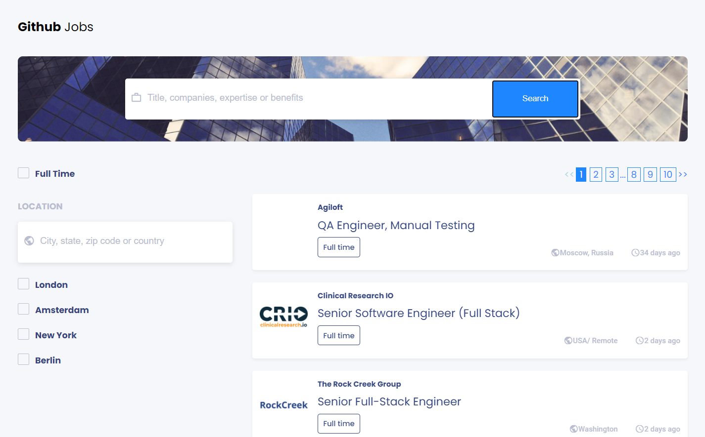

<h1>Github Jobs Search</h1>
<h2>Project Entry from <a href="https://devchallenges.io/challenges/TtUjDt19eIHxNQ4n5jps">Devchallenges.io</a></h2>

<h2>Project Details</h2>

The Github Jobs API Project is a challenge to build an interface to utilize the Github Jobs API endpoint. The API provides the abilities to custom tailor searches based on various criteria (location, description, full-time, etc). API results are limited to a maximum of 50 jobs returned per query, with the ability to use pagination to fetch more.

<h2>Live Demo</h2>

Please Note: I use my own cors-anywhere implementation as a way to proxy calls to the Github API (as the project challenge had suggested). My proxy is hosted on heroku, <strong>so your first search may make a few seconds to spin up.</strong>

<h2>How to Install</h2>

To view the project and run it locally, simply click on the download button above or clone the repo. <strong>You will need to have Node/NPM installed</strong>. Once the project is downloaded or cloned, simply run <code>npm install</code> to install all of the node libraries (React, etc).  
<code>npm run start</code> will run the project locally.

